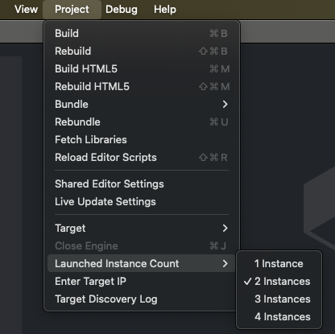

# LuaSec
This is the LuaSec module for the [Defold game engine](http://www.defold.com), based on [Brunoos' implementation](https://github.com/brunoos/luasec) and OpenSSL 3.4.1.

## Installation
You can use LuaSec in your own project by adding this project as a [Defold library dependency](http://www.defold.com/manuals/libraries/). Open your game.project file and in the dependencies field under project add:

https://github.com/britzl/defold-luasec/archive/master.zip

## Usage
For the usage see the [Brunoos' documentation](https://github.com/brunoos/luasec/wiki) please.

## Limitations
This module is available for all platforms that are currently supported by [Native Extensions](http://www.defold.com/manuals/extensions/).

## How to run tests
1. Generate test certificates:
```sh
cd ./tests/certs; ./all.sh
cd ../dhparam; ./params.sh
cd ../multicert; ./gencerts.sh
cd ../key; ./genkey.sh
```
2. In Defold's Editor select 2 instance to run `Project -> Launched Instance Count -> 2 Instances`

    
3. Hit `Project->Build`

To test select `client` in one instance and `server` - from another instance (both should be from the same category). Server usually listens to some incoming connection which can lead to Application not responding until any connect happens.